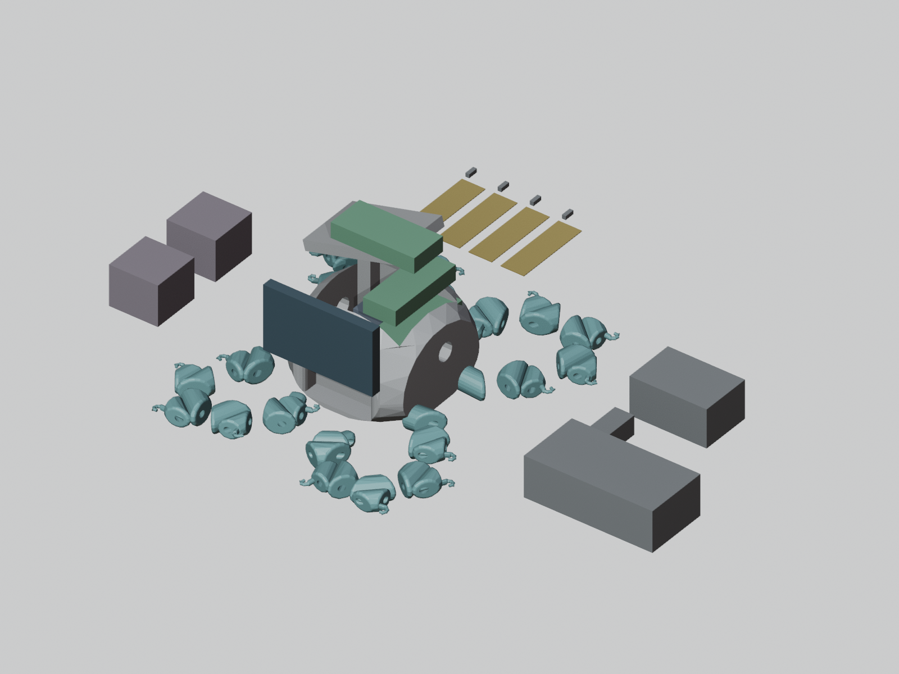
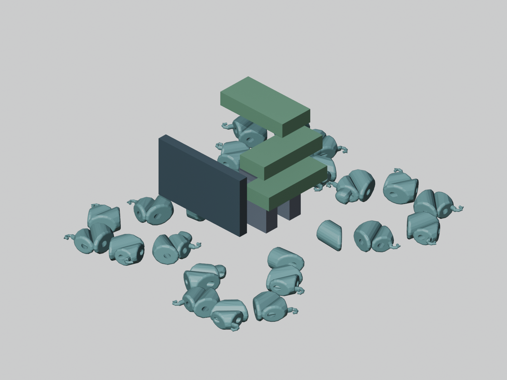

# FreeCAD reference assembly

## Files

- `CAD/reference/octopus-reference-assembly.FCStd`: native FreeCAD layout.
- `CAD/reference/octopus-reference-assembly.step`: exported reference solids, in mm.
- `CAD/reference/verification.json`: geometry and STEP round-trip checks.
- `CAD/reference-parts.json`: component dimensions, sources and budget inputs.
- `CAD/build_reference.FCMacro`: reproducible FreeCAD builder.
- `BOM.csv` and `docs/bom.md`: two-servo and full-layout planning quantities/costs.

This is **not fabrication ready** and does not satisfy the complete integrated
assembly requirement on its own. It preserves the author's 25-piece STL and
adds electronics envelopes. No source geometry was rescaled or redesigned.

## What the CAD represents

The author geometry consists of one shell and 24 disconnected segment pieces.
Each closed mesh is converted to a valid solid. Curved surfaces remain faceted:
an STL conversion cannot recover Shapr3D sketches, smooth surfaces, dimensions
or design history. Re-exporting the original Shapr3D assembly as STEP is preferred.

Reference electronics include four MG90D servo bodies, two ESP32-S3 DevKitC
boards, Pi Zero 2 W and a display. The Pi is above the shell as a provisional
external placement, not fitted inside it: the tested internal envelope layouts
clashed with the shell or other electronics. A roof mount and protective
enclosure still need design, or the internal layout/controller choices need revision.
Joysticks, power bricks, FSRs, resistors,
DC adapter and microSD are shown outside the shell as bench/unmounted items.
The FSR positions are not proposed contact locations. The screen is outside
the front wall; its cutout and mounting arrangement have not been designed.

Part labels and FreeCAD properties distinguish supplier dimensions from
unverified clearance allowances. These are simplified boxes, not vendor CAD.
Servo tabs, horns, wires and plug clearances are not accurately represented.
Do not manufacture mounts or drill holes from these envelopes.

## Checks and limitations

The builder requires all 25 original meshes to be closed, converts each to one
valid positive-volume solid, exports the complete displayed reference layout,
then re-reads STEP and checks solid count, validity, volume and bounding box.
It also reports overlaps between proposed robot-electronics envelopes and the
shell, and between those electronics. Check `verification.json`; an overlap is
an unresolved packaging issue, not something to ignore.

The current reference layout has zero solid-volume overlaps, but controller
`E01Controller1` touches an internal shell surface: minimum nominal shell
clearance is 0 mm. This is recorded as an unresolved surface contact, not a
successful fit. Trial offsets produced other clashes. Resolve its measured
board/header envelope and mounting arrangement before fabrication. The STEP
validity checks do not certify assembly clearance.

An empty overlap list only applies to the selected nominal envelopes. It does
not establish mount strength, full component clearance, moving-arm clearance,
cable access, actual torque, tendon travel, joint retention or feasibility of
the return/unfurl mechanism. No collision-free swept-motion claim is made.

Four servos are a proposed upgrade from the original two-servo concept.
Current firmware controls only one servo per controller; the full layout needs
matching firmware and four sensor channels. Pi/display software is not included.
The servo and supply current/thermal budget still requires measurement. This is
a tethered tabletop concept, not flight hardware.

## Reference views

These are Blender renders using FreeCAD's verified component placements, not
vendor models or screenshots of a finished assembly. Green boxes are board
envelopes, dark boxes are servos/display, and mustard rectangles are unmounted
FSR envelopes. External controls and supplies are shown beside the robot.



The next view hides the shell to expose the proposed electronic placements.
Components have no modeled support brackets yet; the image does not show an
assembled or mechanically supported robot.



## Rebuild

Use FreeCAD 1.1.x. Open `CAD/build_reference.FCMacro` with Macro > Macros and
execute it. If FreeCAD does not provide the macro path, set `ISS_ASSISTANT_REPO`
to the repository directory before launching FreeCAD. The builder uses relative
repository paths and writes the reference CAD and verification report.

For a console build:

```sh
ISS_ASSISTANT_REPO="$PWD" FreeCADCmd CAD/build_reference.FCMacro
```

On macOS the bundled console executable is named `freecadcmd` inside FreeCAD.app.
Check saved files with `FreeCADCmd tools/check_reference.py`. Check the CSV with
`python3 tools/check_bom.py`. After changing budget inputs, run
`python3 tools/update_bom.py` and refresh the displayed documentation totals.

The native file contains grouped positioned parts, not constrained moving
Assembly-workbench joints. Imported author solids are static; reference boxes
have editable dimensions/placements. Running the macro creates a new document
and does not overwrite an open user document.

## Before funding submission or fabrication

1. Obtain original STEP/native author CAD and measured joint axes.
2. Validate one arm's torque, travel, current and return mechanism on the bench.
3. Select stocked actuators and exact power/harness/protection components.
4. Design mounts, joint retention, tendon guides and sensor contact pads.
5. Replace envelope allowances with measured/vendor geometry and check full fit.
6. Implement and test the controller/Pi/display functions actually included.
7. Replace budget allowances with exact linked supplier quotes and quantities.

The author-written README is preserved because Stardance disallows AI-generated
READMEs. This technical documentation must not be presented as independent
author work or evidence of program approval.
